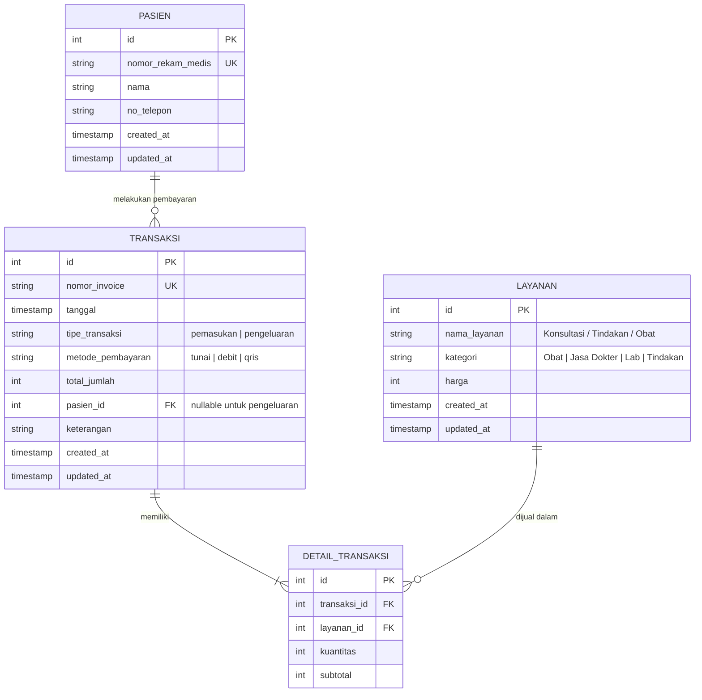
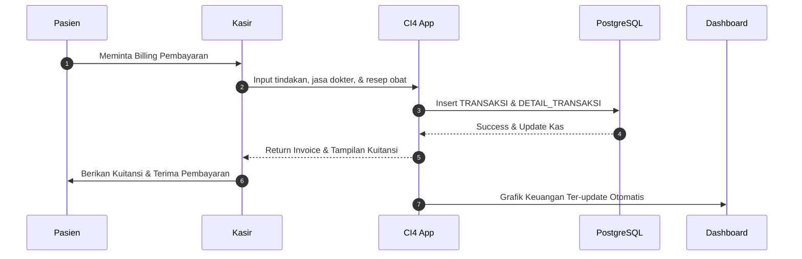

# Kerangka Konsep: Sistem Manajemen Keuangan Klinik (Lokal)

Dokumen ini menjelaskan rancangan konsep, arsitektur, alur data, serta desain visual untuk Sistem Manajemen Keuangan Klinik berbasis **CodeIgniter 4** dengan database **PostgreSQL**.

---

## 1. Arsitektur Sistem (Local-First)

Sistem dirancang dengan arsitektur **Local-First** — seluruh aplikasi berjalan langsung di komputer lokal pengguna.

- **Framework**: CodeIgniter 4.7+ (PHP 8.2+)
- **Database**: PostgreSQL
- **Frontend**: Server-rendered views (CI4) + Chart.js untuk visualisasi grafik

```mermaid
graph TD
    subgraph Klien (Browser)
        A[CI4 Views]
    end
    subgraph Server Lokal
        B[CodeIgniter 4 MVC]
        B --> C[Controllers]
        C --> D[Models]
    end
    subgraph Penyimpanan
        D <-->|PostgreSQL Driver| E[(PostgreSQL Database)]
        D --> F[Backup - pg_dump / CSV Export]
    end
    A <-->|HTTP| B
```

---

## 2. Skema Basis Data (PostgreSQL)



---

## 3. Fitur Utama Sistem

### A. Dashboard Keuangan (Pusat Informasi)
- **Metrik Utama**: Total Pendapatan, Pengeluaran Bulanan, Kas/Laba Bersih, dan Tunggakan/Piutang Pasien.
- **Grafik Interaktif**: Tren pendapatan vs pengeluaran bulanan (menggunakan Chart.js).
- **Notifikasi**: Pengingat pembayaran vendor obat yang akan jatuh tempo.

### B. Manajemen Pemasukan (Kasir / Billing Pasien)
- Pencatatan billing otomatis setelah pasien selesai konsultasi/tindakan.
- Pencetakan kuitansi/invoice (print-friendly).
- Pencatatan metode pembayaran multi-channel (Tunai, Debit, QRIS).

### C. Manajemen Pengeluaran
- Pembelian obat-obatan dan alat kesehatan (Alkes) dari supplier.
- Pengeluaran operasional (Gaji dokter/staf, listrik, air, sewa gedung, dll.).
- Pencatatan utang usaha (pembelian obat secara tempo).

### D. Manajemen Tarif & Inventory (Obat & Jasa)
- Pengaturan harga obat (Harga Beli vs Harga Jual).
- Pengaturan tarif konsultasi dokter dan tindakan medis.

### E. Laporan Keuangan
- **Laporan Laba Rugi**: Menghitung laba kotor dan laba bersih berdasarkan periode.
- **Laporan Arus Kas (Cash Flow)**: Rekapitulasi kas masuk dan keluar secara mendetail.
- **Laporan Bagi Hasil Dokter**: Perhitungan otomatis komisi dokter berdasarkan tindakan/konsultasi yang dilakukan.
- **Export CSV/Excel**: Semua laporan dapat diekspor.

---

## 4. Alur Kerja Keuangan Klinik



---

## 5. Backup Data
Karena database bersifat lokal, risiko kehilangan data perlu dimitigasi:
1. **Auto-backup harian**: Skrip lokal (`pg_dump`) yang mencadangkan database secara otomatis ke folder terpisah.
2. **Export to CSV/Excel**: Modul laporan keuangan dilengkapi fitur ekspor agar data transaksi dapat dicadangkan secara manual.
